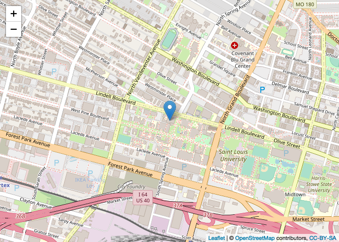
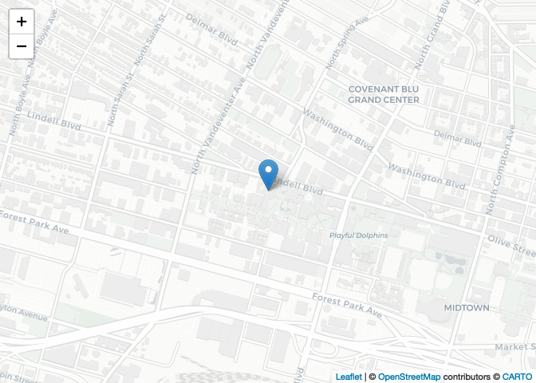
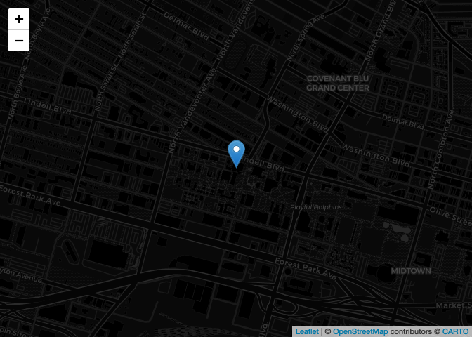
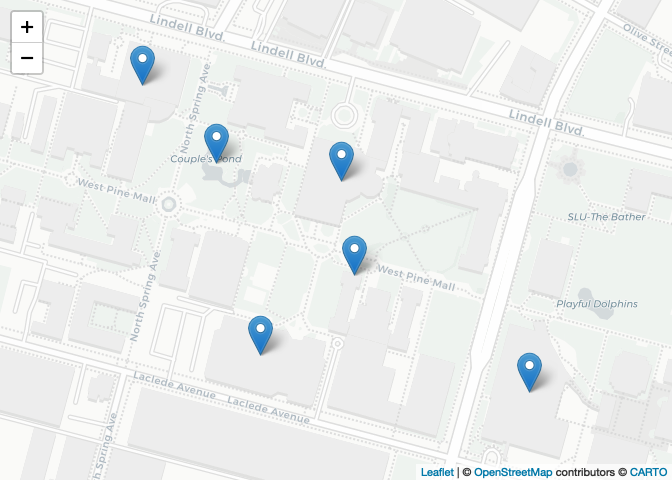
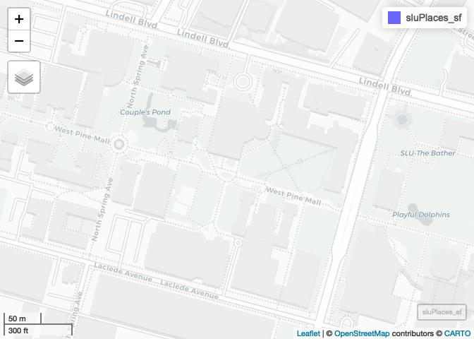
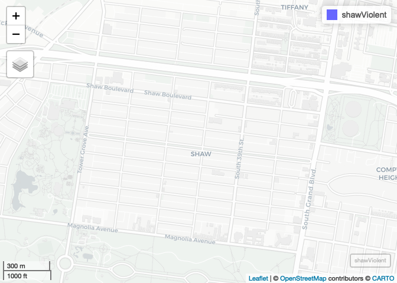
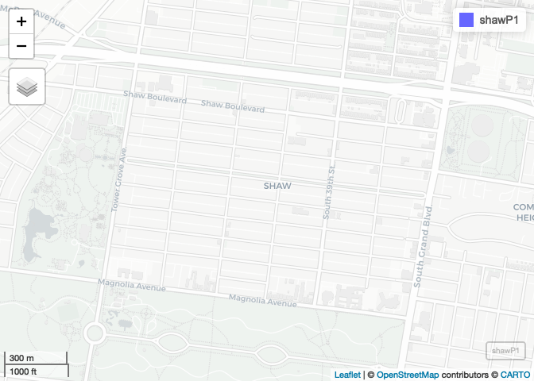
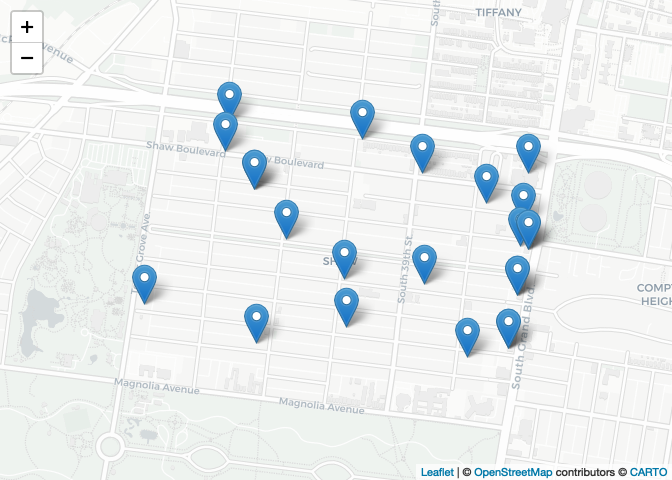
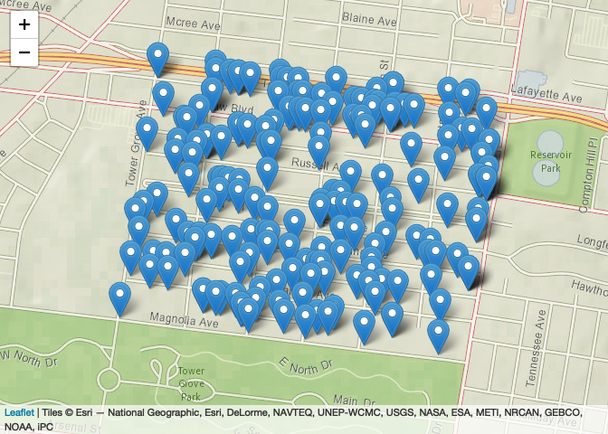

GIS 1 - Spatial Data Basics - Completed Version
================
Christopher Prener, Ph.D.
(August 26, 2020)

## Introduction

This notebook provides a walk-through of the code for for the first
seminar meeting of “Mapping in `R`.”

## Dependencies

This notebook requires the following packages:

``` r
# tidyverse packages
library(magrittr)     # pipe operator
library(readr)        # csv tools

# mapping packages
library(mapview)      # preview spatial data
```

    ## Warning: package 'mapview' was built under R version 4.0.2

    ## GDAL version >= 3.1.0 | setting mapviewOptions(fgb = TRUE)

``` r
library(leaflet)      # interactive maps
library(sf)           # spatial tools
```

    ## Warning: package 'sf' was built under R version 4.0.2

    ## Linking to GEOS 3.8.1, GDAL 3.1.1, PROJ 6.3.1

``` r
# other packages
library(here)         # file path management
```

    ## here() starts at /Users/prenercg/GitHub/DSS/gis-1

## Leaflet

As a way to get to know `R` and RStudio, we’ll be working with the `R`
package [`leaflet`](https://rstudio.github.io/leaflet/). `leaflet` is
the `R` implementation of [`leaflet.js`](http://leafletjs.com), an
open-source Java Script library for building interactive maps.

### A Simple Map

`leaflet` itself is straightforward to get up and running. If we wanted
an interactive map with a marker placed on-top of Morrissey Hall, we
would use the following script entered into `R`:

``` r
leaflet() %>%
  addTiles() %>%
  addMarkers(lng=-90.237104, lat=38.637547, popup="Morrissey Hall")
```

<!-- -->

The `leaflet()` function creates a map widget, and the `addTiles()`
function adds a base map to it. By default,
[OpenStreetMap](https://www.openstreetmap.org) is used for the base map.
Finally, we use `addMarkers()` to specify the longitude and latitude of
our marker, and we enter in a label that will appear as a pop-up when a
user clicks on the marker. `lng`, `lat`, and `popup` are all called
“arguments” - these are used to control how a function operates.

The `%>%` is called the “pipe operator”, and it is used to chain
together functions in what we will call “pipelines”. This pipeline can
be read like a list, with the word **then** substituted for each
instance of `%>%`:

1.  First we create a map widget, **then**
2.  we add base map tiles, **then**
3.  we add a marker at the given longitude and latitude.

### Changing the Base Map

To alter the base map, we can use `addProviderTiles()` in place of
`addTiles()`. I like the CartoDB “Positron” base map. To use the
Positron base map, we create a second pipeline:

``` r
leaflet() %>%
  addProviderTiles(providers$CartoDB.Positron) %>%
  addMarkers(lng=-90.237104, lat=38.637547, popup="Morrissey Hall")
```

<!-- -->

Two things are important to note here. When we load the `leaflet`
package, we have access to a data object called `providers`. You can use
the following syntax to explore it:

``` r
names(providers)
```

    ##   [1] "OpenStreetMap"                      
    ##   [2] "OpenStreetMap.Mapnik"               
    ##   [3] "OpenStreetMap.DE"                   
    ##   [4] "OpenStreetMap.CH"                   
    ##   [5] "OpenStreetMap.France"               
    ##   [6] "OpenStreetMap.HOT"                  
    ##   [7] "OpenStreetMap.BZH"                  
    ##   [8] "OpenSeaMap"                         
    ##   [9] "OpenPtMap"                          
    ##  [10] "OpenTopoMap"                        
    ##  [11] "OpenRailwayMap"                     
    ##  [12] "OpenFireMap"                        
    ##  [13] "SafeCast"                           
    ##  [14] "Thunderforest"                      
    ##  [15] "Thunderforest.OpenCycleMap"         
    ##  [16] "Thunderforest.Transport"            
    ##  [17] "Thunderforest.TransportDark"        
    ##  [18] "Thunderforest.SpinalMap"            
    ##  [19] "Thunderforest.Landscape"            
    ##  [20] "Thunderforest.Outdoors"             
    ##  [21] "Thunderforest.Pioneer"              
    ##  [22] "Thunderforest.MobileAtlas"          
    ##  [23] "Thunderforest.Neighbourhood"        
    ##  [24] "OpenMapSurfer"                      
    ##  [25] "OpenMapSurfer.Roads"                
    ##  [26] "OpenMapSurfer.Hybrid"               
    ##  [27] "OpenMapSurfer.AdminBounds"          
    ##  [28] "OpenMapSurfer.ContourLines"         
    ##  [29] "OpenMapSurfer.Hillshade"            
    ##  [30] "OpenMapSurfer.ElementsAtRisk"       
    ##  [31] "Hydda"                              
    ##  [32] "Hydda.Full"                         
    ##  [33] "Hydda.Base"                         
    ##  [34] "Hydda.RoadsAndLabels"               
    ##  [35] "MapBox"                             
    ##  [36] "Stamen"                             
    ##  [37] "Stamen.Toner"                       
    ##  [38] "Stamen.TonerBackground"             
    ##  [39] "Stamen.TonerHybrid"                 
    ##  [40] "Stamen.TonerLines"                  
    ##  [41] "Stamen.TonerLabels"                 
    ##  [42] "Stamen.TonerLite"                   
    ##  [43] "Stamen.Watercolor"                  
    ##  [44] "Stamen.Terrain"                     
    ##  [45] "Stamen.TerrainBackground"           
    ##  [46] "Stamen.TerrainLabels"               
    ##  [47] "Stamen.TopOSMRelief"                
    ##  [48] "Stamen.TopOSMFeatures"              
    ##  [49] "TomTom"                             
    ##  [50] "TomTom.Basic"                       
    ##  [51] "TomTom.Hybrid"                      
    ##  [52] "TomTom.Labels"                      
    ##  [53] "Esri"                               
    ##  [54] "Esri.WorldStreetMap"                
    ##  [55] "Esri.DeLorme"                       
    ##  [56] "Esri.WorldTopoMap"                  
    ##  [57] "Esri.WorldImagery"                  
    ##  [58] "Esri.WorldTerrain"                  
    ##  [59] "Esri.WorldShadedRelief"             
    ##  [60] "Esri.WorldPhysical"                 
    ##  [61] "Esri.OceanBasemap"                  
    ##  [62] "Esri.NatGeoWorldMap"                
    ##  [63] "Esri.WorldGrayCanvas"               
    ##  [64] "OpenWeatherMap"                     
    ##  [65] "OpenWeatherMap.Clouds"              
    ##  [66] "OpenWeatherMap.CloudsClassic"       
    ##  [67] "OpenWeatherMap.Precipitation"       
    ##  [68] "OpenWeatherMap.PrecipitationClassic"
    ##  [69] "OpenWeatherMap.Rain"                
    ##  [70] "OpenWeatherMap.RainClassic"         
    ##  [71] "OpenWeatherMap.Pressure"            
    ##  [72] "OpenWeatherMap.PressureContour"     
    ##  [73] "OpenWeatherMap.Wind"                
    ##  [74] "OpenWeatherMap.Temperature"         
    ##  [75] "OpenWeatherMap.Snow"                
    ##  [76] "HERE"                               
    ##  [77] "HERE.normalDay"                     
    ##  [78] "HERE.normalDayCustom"               
    ##  [79] "HERE.normalDayGrey"                 
    ##  [80] "HERE.normalDayMobile"               
    ##  [81] "HERE.normalDayGreyMobile"           
    ##  [82] "HERE.normalDayTransit"              
    ##  [83] "HERE.normalDayTransitMobile"        
    ##  [84] "HERE.normalDayTraffic"              
    ##  [85] "HERE.normalNight"                   
    ##  [86] "HERE.normalNightMobile"             
    ##  [87] "HERE.normalNightGrey"               
    ##  [88] "HERE.normalNightGreyMobile"         
    ##  [89] "HERE.normalNightTransit"            
    ##  [90] "HERE.normalNightTransitMobile"      
    ##  [91] "HERE.reducedDay"                    
    ##  [92] "HERE.reducedNight"                  
    ##  [93] "HERE.basicMap"                      
    ##  [94] "HERE.mapLabels"                     
    ##  [95] "HERE.trafficFlow"                   
    ##  [96] "HERE.carnavDayGrey"                 
    ##  [97] "HERE.hybridDay"                     
    ##  [98] "HERE.hybridDayMobile"               
    ##  [99] "HERE.hybridDayTransit"              
    ## [100] "HERE.hybridDayGrey"                 
    ## [101] "HERE.hybridDayTraffic"              
    ## [102] "HERE.pedestrianDay"                 
    ## [103] "HERE.pedestrianNight"               
    ## [104] "HERE.satelliteDay"                  
    ## [105] "HERE.terrainDay"                    
    ## [106] "HERE.terrainDayMobile"              
    ## [107] "FreeMapSK"                          
    ## [108] "MtbMap"                             
    ## [109] "CartoDB"                            
    ## [110] "CartoDB.Positron"                   
    ## [111] "CartoDB.PositronNoLabels"           
    ## [112] "CartoDB.PositronOnlyLabels"         
    ## [113] "CartoDB.DarkMatter"                 
    ## [114] "CartoDB.DarkMatterNoLabels"         
    ## [115] "CartoDB.DarkMatterOnlyLabels"       
    ## [116] "CartoDB.Voyager"                    
    ## [117] "CartoDB.VoyagerNoLabels"            
    ## [118] "CartoDB.VoyagerOnlyLabels"          
    ## [119] "CartoDB.VoyagerLabelsUnder"         
    ## [120] "HikeBike"                           
    ## [121] "HikeBike.HikeBike"                  
    ## [122] "HikeBike.HillShading"               
    ## [123] "BasemapAT"                          
    ## [124] "BasemapAT.basemap"                  
    ## [125] "BasemapAT.grau"                     
    ## [126] "BasemapAT.overlay"                  
    ## [127] "BasemapAT.highdpi"                  
    ## [128] "BasemapAT.orthofoto"                
    ## [129] "nlmaps"                             
    ## [130] "nlmaps.standaard"                   
    ## [131] "nlmaps.pastel"                      
    ## [132] "nlmaps.grijs"                       
    ## [133] "nlmaps.luchtfoto"                   
    ## [134] "NASAGIBS"                           
    ## [135] "NASAGIBS.ModisTerraTrueColorCR"     
    ## [136] "NASAGIBS.ModisTerraBands367CR"      
    ## [137] "NASAGIBS.ViirsEarthAtNight2012"     
    ## [138] "NASAGIBS.ModisTerraLSTDay"          
    ## [139] "NASAGIBS.ModisTerraSnowCover"       
    ## [140] "NASAGIBS.ModisTerraAOD"             
    ## [141] "NASAGIBS.ModisTerraChlorophyll"     
    ## [142] "NLS"                                
    ## [143] "JusticeMap"                         
    ## [144] "JusticeMap.income"                  
    ## [145] "JusticeMap.americanIndian"          
    ## [146] "JusticeMap.asian"                   
    ## [147] "JusticeMap.black"                   
    ## [148] "JusticeMap.hispanic"                
    ## [149] "JusticeMap.multi"                   
    ## [150] "JusticeMap.nonWhite"                
    ## [151] "JusticeMap.white"                   
    ## [152] "JusticeMap.plurality"               
    ## [153] "Wikimedia"                          
    ## [154] "GeoportailFrance"                   
    ## [155] "GeoportailFrance.parcels"           
    ## [156] "GeoportailFrance.ignMaps"           
    ## [157] "GeoportailFrance.maps"              
    ## [158] "GeoportailFrance.orthos"            
    ## [159] "OneMapSG"                           
    ## [160] "OneMapSG.Default"                   
    ## [161] "OneMapSG.Night"                     
    ## [162] "OneMapSG.Original"                  
    ## [163] "OneMapSG.Grey"                      
    ## [164] "OneMapSG.LandLot"

`providers` is a vector of items, each of which corresponds to a
different base map. We can select one of those items,
`CartoDB.Positron`, by separating `providers` from the item name with a
dollar sign (`$`). This is a classic way in which elements of a data set
are accessed in `R` syntax.

Now, you try to select a base map from `providers` and alter the code
chunk from above to reproduce the map showing Morrissey Hall:

``` r
leaflet() %>%
  addProviderTiles(providers$CartoDB.DarkMatter) %>%
  addMarkers(lng=-90.237104, lat=38.637547, popup="Morrissey Hall")
```

<!-- -->

### Adding Additional Points

The `data/sluPlaces.csv` file (a `.csv` file is a type of spreadsheet)
contains information on a couple of other places where I find myself
regularly on campus. We can read it into `R` using the `readr` package
(part of the tidyverse):

``` r
sluPlaces <- read_csv(here("data", "sluPlaces.csv"))
```

    ## Parsed with column specification:
    ## cols(
    ##   id = col_double(),
    ##   name = col_character(),
    ##   lng = col_double(),
    ##   lat = col_double()
    ## )

We read the statement from right to left - the data found at
`data/sluPlaces.csv` is read correctly as `.csv` data, and the resulting
imported data is stored in an object in our global environment named
`sluPlaces`. The `here()` function helps us write simple, operating
system agnostic file paths that will always be relative to where the
`.Rproj` file is stored. We’ll talk more about this as the semester
progresses.

We can explore the data a number of ways, including with the `View()`
(output not shown) function and the `str()` function:

``` r
str(sluPlaces)
```

    ## tibble [6 × 4] (S3: spec_tbl_df/tbl_df/tbl/data.frame)
    ##  $ id  : num [1:6] 1 2 3 4 5 6
    ##  $ name: chr [1:6] "Morrissey Hall" "Starbucks" "Simon Rec" "Pius Library" ...
    ##  $ lng : num [1:6] -90.2 -90.2 -90.2 -90.2 -90.2 ...
    ##  $ lat : num [1:6] 38.6 38.6 38.6 38.6 38.6 ...
    ##  - attr(*, "spec")=
    ##   .. cols(
    ##   ..   id = col_double(),
    ##   ..   name = col_character(),
    ##   ..   lng = col_double(),
    ##   ..   lat = col_double()
    ##   .. )

If we wanted to use `View()`, it would be implemented like this:

``` r
View(sluPlaces)
```

When executed in the console, it will produce a spreadsheet-like view
within RStudio.

The `.csv` data are *tabular* data - they contain longitude and latitude
data, but they are not *projected*. This means we are missing the
geometric data that locates these longitude and latitude data in space.
leaflet can take these spatial references, however, and convert them to
usable geometric data. We do so using a very similar process to what we
did before:

``` r
leaflet(data = sluPlaces) %>%
  addProviderTiles(providers$CartoDB.Positron) %>%
  addMarkers(lng = ~lng, lat = ~lat, popup = ~name)
```

<!-- -->

The `data = sluPlaces` argument in `leaflet()` directs `R` to the
appropriate data set to map. We use the tilde (`~`) to indicate to
leaflet that these are variables within `sluPlaces`.

## Converting to `sf` Objects

In practice, we don’t usually build maps this way. Instead, we convert
our tabular data to an `sf` object, which contains a `geometry` column
that is ready for mapping and spatial data wrangling. Our `sluPlaces`
data can be converted using the `st_as_sf()` function from the `sf`
package.

``` r
sluPlaces_sf <- st_as_sf(sluPlaces, coords = c("lng", "lat"), crs = 4269)
```

The `lng` and `lat` columns contain our `x` and `y` values for
coordinates, respectively. `lng` is short for “longitude,” which are the
vertical lines that extend east and west from the prime meridian. `lat`
is short for latitude, which are the horizontal lines that extend north
and south from the equator.

The `crs` value of `4269` refers to a *geographic coordinate system,*
which is a model of the earth’s surface that expresses locations in
decimal degrees. These are another way of representing longitude and
latitude. `4269` is known as “NAD83,” which stands for North American
Datum 1983. This is a model that is specific to North America. The other
common geographic coordinate system we use is WGS84, which can be used
anywhere in the world. Its `crs` value is `4326`.

Once we build `sluPlaces_sf`, we can see that its properties have
changed:

``` r
class(sluPlaces)
```

    ## [1] "spec_tbl_df" "tbl_df"      "tbl"         "data.frame"

``` r
class(sluPlaces_sf)
```

    ## [1] "sf"         "tbl_df"     "tbl"        "data.frame"

We can also easily start to work with our data. For example, we can use
`View()` (or click on our object in the global environment) to get a
sense of its columns and rows. Note the `geometry` column - this
contains the information `R` packages need to create maps with our data.

We can also use the `mapview` package to preview our data:

``` r
mapview(sluPlaces_sf)
```

<!-- -->

This is particularly useful for making sure data have been projected
correctly, and getting a sense of the spatial *extent* of our data.

## Working with Shapefiles

“Shapefiles” are a type of file format (actually a collection of files)
that were popularized by ESRI, the makers of the ArcGIS software
platform. These files are very, very common in the GIS world. They
contain both the geometric and tabular data needed to map data. They’re
a bit clunky to work with using your operating system - there can be
over a dozen constituent files, and they all must be named identically.
So, they’re not the most friendly files to work with, but their ubiquity
makes it important to know a bit about how to work with them.

### Reading Shapefiles

For data that have already been converted to geometric data, we use the
`sf` package to read them. The importing process looks similar to what
we used with the `.csv` file. We’ll demonstrate this with the violent
crime data for Shaw:

``` r
shawViolent <- st_read(here("data", "SHAW_Violent_2018.shp"), stringsAsFactors = FALSE)
```

    ## Reading layer `SHAW_Violent_2018' from data source `/Users/prenercg/GitHub/DSS/gis-1/data/SHAW_Violent_2018.shp' using driver `ESRI Shapefile'
    ## Simple feature collection with 23 features and 8 fields
    ## geometry type:  POINT
    ## dimension:      XY
    ## bbox:           xmin: -90.25692 ymin: 38.60956 xmax: -90.24046 ymax: 38.61747
    ## geographic CRS: GRS 1980(IUGG, 1980)

We’ll still use `here()` to specify the file path, but the function is
different now because we need a specialized tool for geometric data.
Note that we open the `.shp` file - this is the primary piece of the
*family* of files that together contain all of the relevant information
to locate the Shaw violent crime data in space and describe it. We work
with `SHAW_Violent_2018.shp`, but the other parts must be present as
well.

Now, you repeat this process for the `SHAW_Part1_2018.shp`, which is
stored in the same directory:

``` r
shawP1 <- st_read(here("data", "SHAW_Part1_2018.shp"), stringsAsFactors = FALSE)
```

    ## Reading layer `SHAW_Part1_2018' from data source `/Users/prenercg/GitHub/DSS/gis-1/data/SHAW_Part1_2018.shp' using driver `ESRI Shapefile'
    ## Simple feature collection with 201 features and 8 fields
    ## geometry type:  POINT
    ## dimension:      XY
    ## bbox:           xmin: -90.25783 ymin: 38.60749 xmax: -90.24034 ymax: 38.61776
    ## geographic CRS: GRS 1980(IUGG, 1980)

### Previewing Data

Once we have our data read in, we can start to explore it. First, take a
moment to use `View()` (or click on each of the Shaw objects in your
global environment) to check out their structure and get a sense of the
different columns. Next, lets use `mapview` to explore our data:

``` r
mapview(shawViolent)
```

<!-- -->

Now, you repeat this process with the Part 1 crime data for Shaw:

``` r
mapview(shawP1)
```

<!-- -->

### Prepping Our Data

In order to use `leaflet` effectively, we need to “transform” our data
to WGS84. We use the `sf` package’s `st_transform()` function to do
this:

``` r
shawViolent <- st_transform(shawViolent, crs = 4326)
```

Now, you try this syntax out on the Shaw Part 1 crime data:

``` r
shawP1 <- st_transform(shawP1, crs = 4326)
```

### Creating Interactive Maps

Finally, we’ll build some simple interactive maps. Since our data are
`sf` objects, we no longer need to specify the `x` and `y` columns. This
makes our code a bit easier to read and write\! We use the simplified
crime category (`crimeCt`) for the popup this time:

``` r
leaflet(data = shawViolent) %>%
  addProviderTiles(providers$CartoDB.Positron) %>%
  addMarkers(popup = ~crimeCt)
```

<!-- -->

Now, you repeat this process for the Shaw Part 1 crime data, swapping
out out both the base map and the data object:

``` r
leaflet(data = shawP1) %>%
  addProviderTiles(providers$Esri.NatGeoWorldMap) %>%
  addMarkers(popup = ~crimeCt)
```

<!-- -->
